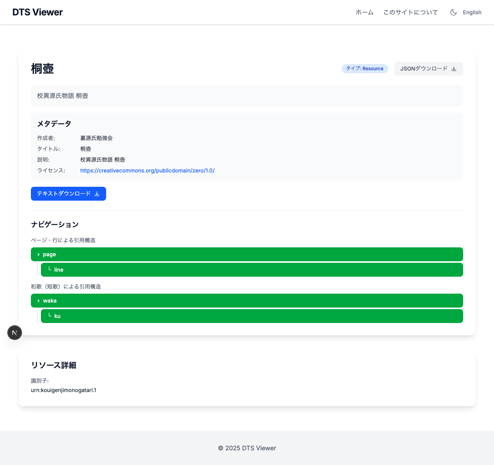
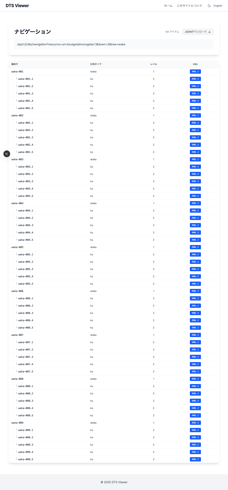
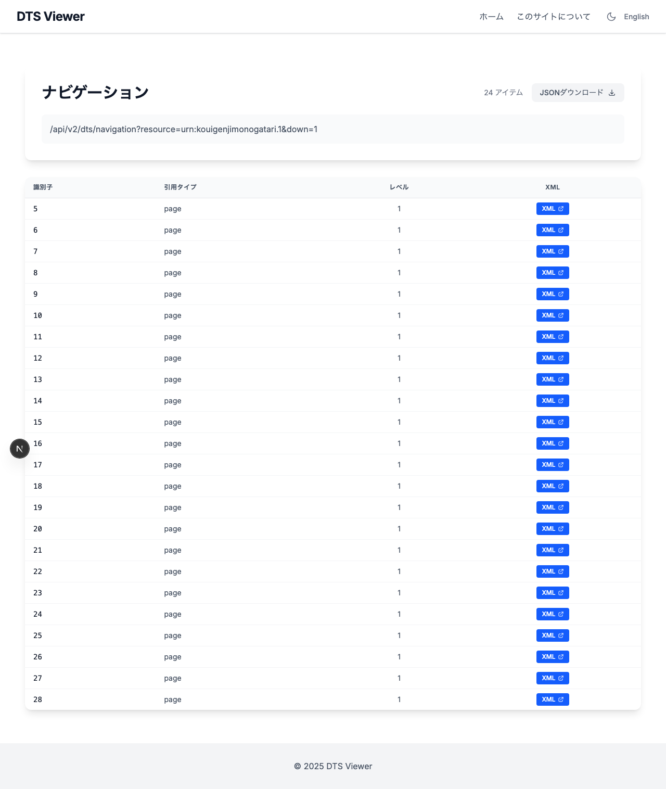
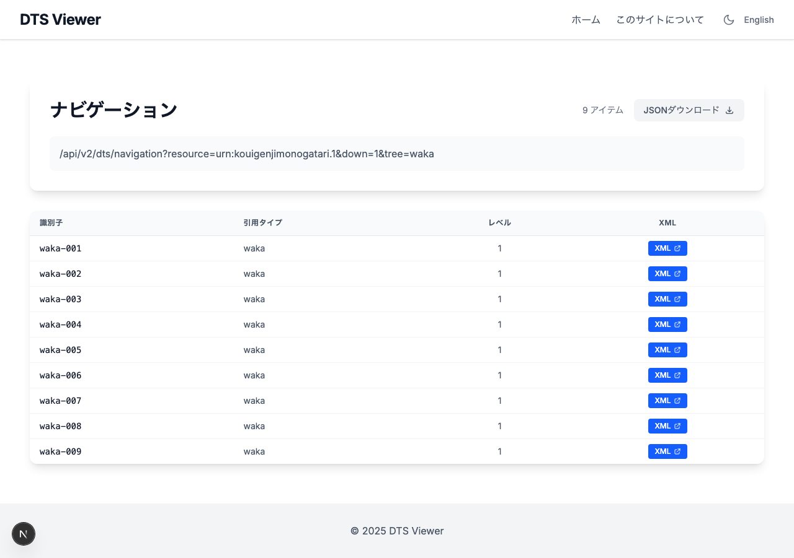
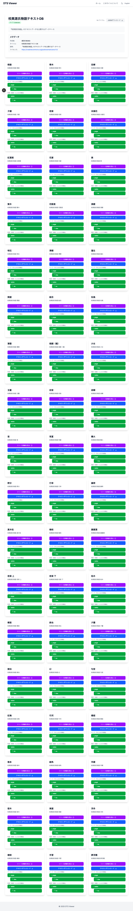

## はじめに

[前回の記事](./dts-1-0-migration)で、校異源氏物語テキストDB用 DTS API を 1.0 仕様に対応させ、和歌（短歌）の Citation Tree を追加しました。

本記事では、そのAPIを利用するビューアアプリ「[DTS Viewer](https://dts-viewer.vercel.app/)」側で行った改善について紹介します。

主な改善点は以下の3つです。

1. **複数 Citation Tree への対応** ― `tree` パラメータの正しい受け渡し
2. **ナビゲーション結果の階層表示** ― カード形式からテーブル形式への変更
3. **XML のブラウザ内表示** ― `mediaType` パラメータの活用

## 1. 複数 Citation Tree への対応

### 問題

DTS 1.0 では、1つのリソースに複数の Citation Tree を定義できます。校異源氏物語では「ページ/行」と「和歌」の2つのツリーを持っています。

しかし、ビューアのナビゲーションリンクが `tree` パラメータを付与していなかったため、和歌ツリーのリンクをクリックしてもデフォルト（ページ/行）のナビゲーションが表示される問題がありました。

### 対応

Citation Tree の `identifier` を追跡し、ナビゲーション URL に `&tree=${identifier}` を付与するようにしました。

```typescript
const getNavigationUrl = (navigation: string, url: string, level: number, tree?: string) => {
  navigation = decodeURIComponent(navigation);
  navigation = removeVars(navigation) + `&down=${level}`;
  if (tree) {
    navigation += `&tree=${tree}`;
  }
  const combined = getDomain(url) + navigation;
  return encodeURIComponent(combined);
};
```

### ツリー構造の視覚化

各 Citation Tree をツリー形式で表示し、`description` ラベルで区別できるようにしました。


*リソース詳細ページ。「ページ・行による引用構造」と「和歌（短歌）による引用構造」が視覚的に分かれて表示されている。*

`renderCiteStructure` を再帰関数にすることで、3階層以上の構造にも対応可能です。

```tsx
const renderCiteStructure = (
  citeStructures: unknown[],
  treeIdentifier: string | undefined,
  level: number,
): React.ReactNode => {
  return citeStructures.map((cs, index) => {
    const citeType = (cs as { citeType: string }).citeType;
    const children = (cs as { citeStructure?: unknown[] }).citeStructure;
    return (
      <div key={index} className={level > 1 ? 'ml-4 border-l-2 pl-2' : ''}>
        <Link href={`/?base=${base}&url=${getNavigationUrl(...)}`}>
          <span>{level > 1 ? '└' : '▸'}</span> {citeType}
        </Link>
        {children && (
          <div className="mt-1">
            {renderCiteStructure(children, treeIdentifier, level + 1)}
          </div>
        )}
      </div>
    );
  });
};
```

## 2. ナビゲーション結果の階層表示

### 問題

`down=2` で複数階層のデータを取得した場合、DTS API は `parent` フィールドで親子関係を示します。

```json
{
  "member": [
    { "identifier": "waka-001", "level": 1, "parent": null, "citeType": "waka" },
    { "identifier": "waka-001.1", "level": 2, "parent": "waka-001", "citeType": "ku" },
    { "identifier": "waka-001.2", "level": 2, "parent": "waka-001", "citeType": "ku" }
  ]
}
```

元のビューアはこれをフラットなカードグリッドで表示していたため、親子関係が視覚的に分からず、カードが大量に並ぶ非常に縦長なページになっていました。

### 対応

カードからテーブルに変更し、`parent` フィールドを使って階層をインデントで表現するようにしました。


*和歌ナビゲーション結果。waka（親）の下に ku（句）がインデント付きで表示されている。*

再帰的な `renderTreeRows` 関数で、任意の深さの階層に対応しています。

```tsx
const renderTreeRows = (parentMembers: ReferenceData[], depth: number): React.ReactNode => {
  return parentMembers.map((member, index) => {
    const children = childrenByParent.get(member.identifier) || [];
    return (
      <React.Fragment key={`${depth}-${index}`}>
        <tr>
          <td>
            <span style={{ paddingLeft: `${depth * 1.5}rem` }}>
              {depth > 0 && <span>└</span>}
              {member.identifier}
            </span>
          </td>
          <td>{member.citeType}</td>
          <td>{member.level}</td>
          <td><a href={getPassage(member.identifier)}>XML</a></td>
        </tr>
        {children.length > 0 && renderTreeRows(children, depth + 1)}
      </React.Fragment>
    );
  });
};
```

階層のない単純なナビゲーション結果（`down=1`）も同じテーブル形式で表示されます。


*ページナビゲーション結果。階層がないためフラットなテーブルで表示される。*


*和歌一覧。`tree=waka` でのナビゲーション結果。*

## 3. XML のブラウザ内表示

### 問題

DTS 1.0 の Document エンドポイントは `Content-Type: application/tei+xml` を返します。これは仕様上正しいのですが、ブラウザはこの MIME タイプを認識できず、ファイルダウンロードとして処理してしまいます。

### 対応（API側）

DTS 1.0 の `mediaType` パラメータを活用しました。このパラメータはまさにこの用途のために仕様に含まれています。

```typescript
// document.ts
const { ref, resource, start, end, tree, mediaType } = req.query;

const allowedMediaTypes = ["application/tei+xml", "application/xml", "text/xml"];
let contentType = "application/tei+xml"; // DTS 1.0 default

if (requestedMediaType) {
  if (allowedMediaTypes.includes(requestedMediaType)) {
    contentType = requestedMediaType;
  } else {
    res.status(406).json({ error: `Unsupported mediaType` });
    return;
  }
}

res.set("Content-Type", contentType);
```

- デフォルト（`mediaType` 未指定）: `application/tei+xml`（DTS 1.0 準拠）
- `mediaType=application/xml`: ブラウザが認識する XML として返す
- 未対応の `mediaType`: `406 Not Acceptable`

### 対応（Viewer側）

ビューアからのドキュメントリンクに `&mediaType=application/xml` を自動付与し、さらに `<Link>` から `<a target="_blank">` に変更しました。

```typescript
// Navigation.tsx - getPassage()
// ブラウザで表示できるようにmediaTypeを指定
result = result + '&mediaType=application/xml';
```

Next.js の `<Link>` コンポーネントは内部ルーティング用のため、外部 URL に使うとダウンロードになるケースがありました。通常の `<a>` タグに変更することで、新しいタブで XML がブラウザ表示されます。

## コレクション一覧の表示


*コレクション一覧。各巻のリソースにページ/行と和歌のナビゲーションリンクが表示されている。*

## 変更ファイル一覧

### DTS API（dts-typescript）

| ファイル | 変更内容 |
|---------|---------|
| `src/api/v2/document.ts` | `mediaType` パラメータ対応、Content-Type の動的切り替え |

### DTS Viewer（dts-viewer）

| ファイル | 変更内容 |
|---------|---------|
| `src/lib/collection.ts` | `CitationTree` 型に `identifier`、`description` フィールド追加 |
| `src/lib/navigation.ts` | `ReferenceData` 型に `parent` フィールド追加 |
| `src/components/page/Collections.tsx` | `tree` パラメータ付与、ツリー形式の Citation Tree 表示 |
| `src/components/page/Resource.tsx` | 同上 |
| `src/components/page/Navigation.tsx` | テーブル形式、階層表示、`tree` 引き継ぎ、`mediaType` 付与、`<a>` タグ化 |

## おわりに

DTS 1.0 の `tree` パラメータや `mediaType` パラメータは、まさに今回のような課題を解決するために仕様に含まれています。API 側で仕様に準拠した実装を行い、ビューア側でそれらのパラメータを適切に活用することで、複数の引用構造を持つテキストコレクションのブラウジング体験を向上させることができました。

### 参考リンク

- [DTS Viewer](https://dts-viewer.vercel.app/)
- [DTS Viewer ソースコード](https://github.com/nakamura196/dts-viewer)
- [校異源氏物語テキストDB DTS API](https://dts-typescript.vercel.app/api/v2/dts)
- [DTS 1.0 仕様](https://dtsapi.org/specifications/versions/v1.0/)
